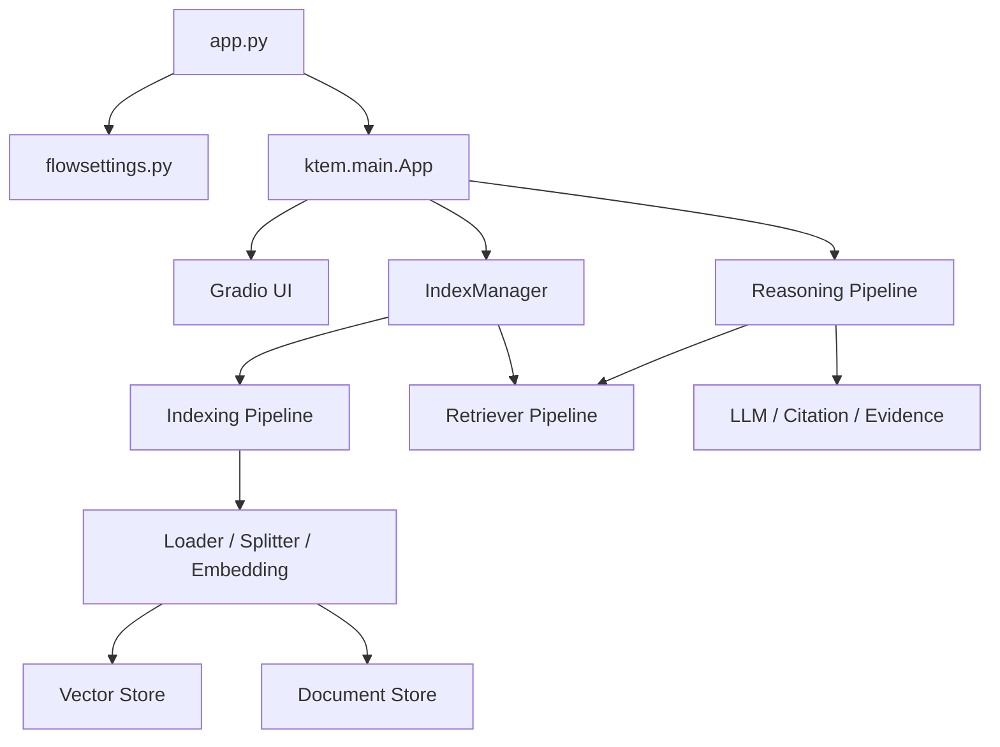

# Knowledge Assistant

> [!WARNING]
> 本项目正在重构中，当前代码、配置和使用方式可能随时发生变化，暂不建议用于生产环境。

## 项目定位

Knowledge Assistant 当前是一个单进程、配置驱动、组件化的 RAG Web 应用，基于 Kotaemon 的核心能力和应用层进行后续重构。

> 本文描述当前代码实际采用的 **AS-IS 架构**，不代表 Knowledge Assistant 后续的目标架构。

当前项目主要由两个 Python 包组成：

```text
libs/
├── kotaemon/    RAG 核心框架与基础组件
└── ktem/        Web 应用、业务编排和用户界面
```

- `kotaemon` 提供 Document 数据结构、模型封装、索引、检索、切片、存储和问答能力；
- `ktem` 提供 Gradio UI、用户与会话管理、知识库管理、配置管理和 Pipeline 装配；
- `flowsettings.py` 同时承担全局配置、依赖装配、组件注册和默认资源声明；
- `app.py` 是当前应用启动入口。

## 当前架构



当前所有主要模块运行在同一个 Python 进程中，尚未形成独立的前端服务、知识服务、RAG 服务或 API Gateway。

默认数据存储为：

| 用途 | 当前实现 |
| --- | --- |
| 应用数据库 | SQLite |
| 原文件存储 | 本地文件系统 |
| Document Store | LanceDB |
| Vector Store | ChromaDB |

主要架构限制包括 UI 与业务编排耦合、`flowsettings.py` 职责过重、动态导入依赖较多、存储与 Pipeline 绑定较深，以及缺少独立服务边界。

完整的启动流程、入库流程、检索流程、问答流程、扩展机制和现存问题见：

- [当前架构说明](docs/architecture/current-architecture.md)
- [开发文档入口](docs/development/index.md)

## 项目状态

本仓库目前处于重构准备阶段。安装、部署和功能文档将在项目结构与能力稳定后重新编写。当前架构文档只用于说明代码现状，并不承诺这些边界会长期保留。

## Fork 与修改声明

本项目是 [Cinnamon/kotaemon](https://github.com/Cinnamon/kotaemon) 的非官方修改版本，并非原项目的官方发行版，也不代表原项目维护者对本项目的认可或背书。

原始项目及其贡献者保留对原始代码的版权。本仓库在原项目基础上进行修改和后续重构。对上游文件的修改将通过文件内声明或其他显著方式予以标记，Git 提交历史用于补充追踪具体变更。

## 上游项目

- 项目：[Cinnamon/kotaemon](https://github.com/Cinnamon/kotaemon)
- 原项目团队：Kotaemon Team 与相关贡献者
- 原项目引用信息：[Citation](https://github.com/Cinnamon/kotaemon#citation)

感谢原项目作者和所有贡献者所完成的工作。

## 许可证

本项目基于 Apache License 2.0 授权的软件进行修改和分发。许可证全文见 [LICENSE.txt](LICENSE.txt)。

对原项目代码的使用、修改和分发仍须遵守 Apache License 2.0。原始版权、专利、商标及署名声明不因本 Fork 而失效；Apache License 2.0 亦不授予任何商标使用权。
