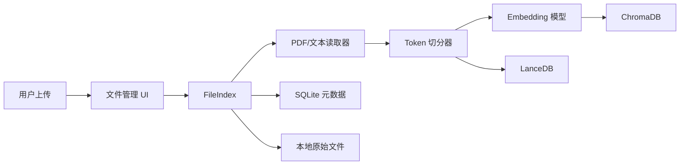
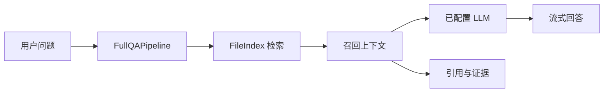

# 当前架构（AS-IS）

本文描述 Knowledge Assistant 当前代码实际运行的最小基线，而不是未来服务化架构提案。

## 运行形态

Knowledge Assistant 是一个由两个工作区包组装而成的单进程 Gradio 应用：

```text
app.py
  -> flowsettings.py
  -> ktem.main.App
       -> Gradio 页面
       -> IndexManager
       -> FileIndex
       -> FullQAPipeline

libs/
  kotaemon/  可复用的 RAG 组件与数据结构
  ktem/      应用装配、持久化与用户界面
```

UI 当前直接调用索引、检索和问答 Pipeline。现有基线中不存在独立 REST API、MCP Server、知识服务或外部 RAG 后端。

## 产品边界

当前注册的产品路径有意保持精简：

| 领域 | 当前基线 |
| --- | --- |
| 认证 | 本地用户名与密码 |
| 索引 | 一个默认 `FileIndex` 知识库 |
| 文件 | PDF、Markdown、纯文本 |
| 检索 | 向量、文本或混合检索 |
| 推理 | 仅 `FullQAPipeline` |
| 输出 | 流式回答、引用、证据与图表文档 |
| 元数据 | SQLite |
| 向量存储 | ChromaDB |
| 文档存储 | LanceDB |
| 原始文件 | 本地文件系统 |

演示模式、SSO、Agent、GraphRAG 变体、Web Search、MCP 工具消费、思维导图、OCR、URL 入库、重排和多模态 Loader 不属于当前产品基线。相关代码可能仍保留，但不代表正式支持。

## 入库流程



文件先经过扩展名、大小和数量校验，再由入库 Pipeline 完成解析、切片、向量化和持久化。`IndexManager` 与 Pipeline 提供了可保留的扩展点，未来可以在其外层增加应用服务和后端适配器。

## 问答流程



当前最小模型路径面向 OpenAI 兼容接口或 Ollama。为了兼容上游代码，配置中暂时保留了其他 Provider，但它们不属于最小产品承诺，后续应在依赖拆分时逐项确认。模型管理器和 Embedding 管理器仍是 Pipeline 使用的配置边界。

## 持久化

应用状态默认持久化到本地：

```text
ktem_app_data/user_data/
  sql.db
  files/
  docstore/
  vectorstore/
```

SQLite 保存用户、知识库、文件元数据、会话和会话所选数据源；ChromaDB 与 LanceDB 保存检索数据；原始上传文件保留在本地文件系统。

## 保留的扩展边界

为了避免后续重写核心 RAG 链路，当前基线应继续保留：

- `BaseComponent` 与 `Document`；
- `IndexManager` 与 `FileIndex`；
- 入库与检索 Pipeline；
- 模型和 Embedding 管理器；
- Pluggy 扩展注册；
- 现有索引与 Pipeline 扩展点。

当前尚不存在外部 RAG 后端适配器契约。最迫切的架构问题是 UI 与 Pipeline 直接耦合。在基线测试完善之前，不建议大规模移动目录、重命名包或直接加入外部 RAG、REST API、MCP Server。

实现细节请继续阅读[开发者指南](../development/index.md)、[运行时流程](../development/runtime-flows.md)和[数据与配置](../development/data-and-configuration.md)。
