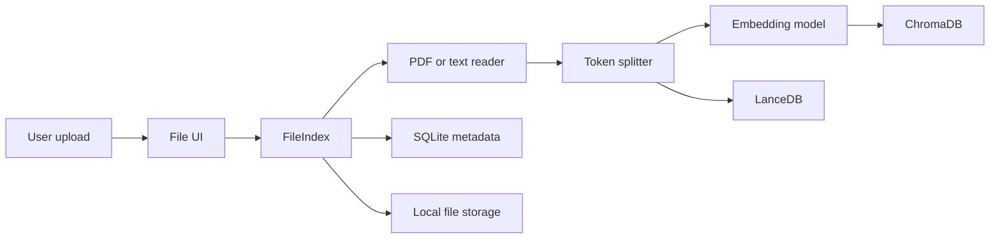
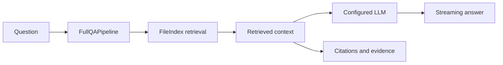

# Current architecture

This page describes the minimal Knowledge Assistant baseline as it exists today.
It is not a proposal for a future service-oriented architecture.

## Runtime shape

Knowledge Assistant is a single-process Gradio application assembled from two
workspace packages:

```text
app.py
  -> flowsettings.py
  -> ktem.main.App
       -> Gradio pages
       -> IndexManager
       -> FileIndex
       -> FullQAPipeline

libs/
  kotaemon/  reusable RAG components and data structures
  ktem/      application assembly, persistence, and UI
```

The UI currently invokes indexing, retrieval, and QA pipelines directly. There
is no separate REST API, MCP server, knowledge service, or external RAG backend
in the baseline.

## Product boundary

The registered product path is intentionally narrow:

| Area | Baseline |
| --- | --- |
| Authentication | Local username and password |
| Index | One default `FileIndex` collection |
| Files | PDF, Markdown, and plain text |
| Retrieval | Vector, text, or hybrid |
| Reasoning | `FullQAPipeline` only |
| Output | Streaming answer, citations, evidence, and plot documents |
| Metadata | SQLite |
| Vector store | ChromaDB |
| Document store | LanceDB |
| Original files | Local filesystem |

Demo mode, SSO, Agents, GraphRAG variants, Web Search, MCP tool consumption,
Mindmap generation, OCR, URL ingestion, reranking, and multimodal loaders are
outside this baseline.

## Indexing flow



Files are validated against the supported extensions before the indexing
pipeline parses, chunks, embeds, and persists them. `IndexManager` and the
pipelines provide existing extension points that may later be wrapped by
backend adapters.

## Question-answering flow



The intended minimal model path is OpenAI-compatible APIs or Ollama.
Additional provider registrations remain temporarily available for upstream
compatibility, but they are not part of the minimal product contract and will
be reviewed during dependency and provider splitting. Model and embedding
managers remain the configuration boundary used by the pipelines.

## Persistence

Application state is local and persistent:

```text
ktem_app_data/user_data/
  sql.db
  files/
  docstore/
  vectorstore/
```

SQLite stores users, collections, file metadata, conversations, and each
conversation's selected data sources. ChromaDB and LanceDB store retrieval data,
while original uploads remain on the local filesystem.

## Retained extension boundaries

The minimal baseline keeps these abstractions so later changes do not require a
rewrite of the core RAG path:

- `BaseComponent` and `Document`
- `IndexManager` and `FileIndex`
- indexing and retrieval pipelines
- model and embedding managers
- Pluggy extension registration
- existing index and pipeline extension points that may later be wrapped by
  backend adapters

No external RAG backend adapter contract exists in the current baseline.

The next architectural pressure point is the direct UI-to-pipeline coupling.
Directory moves, package renames, external RAG backends, REST APIs, and an MCP
server should be addressed only after this baseline remains protected by tests.
