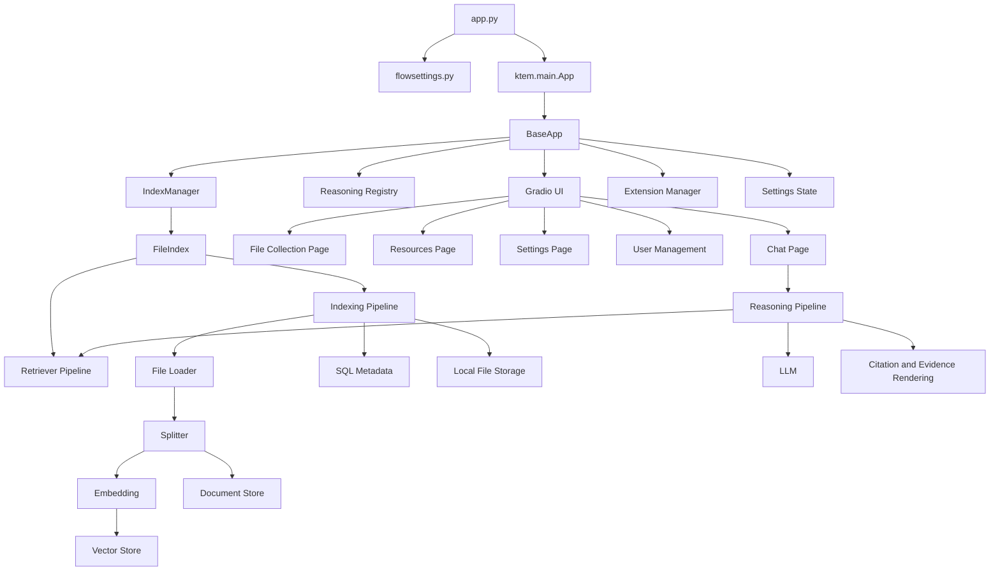
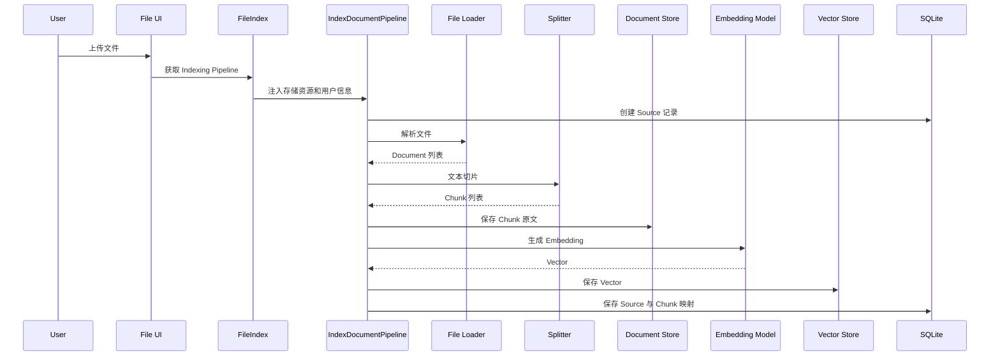
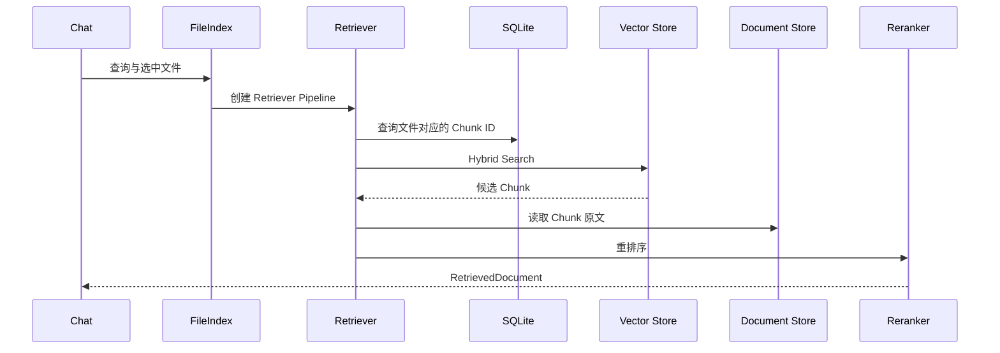
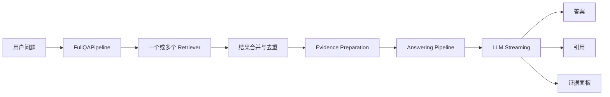

# Knowledge Assistant 当前架构

> 本文描述当前代码实际采用的 Kotaemon 架构，即 **AS-IS 架构**，不代表 Knowledge Assistant 后续的目标架构。

## 1. 整体定位

当前项目是一个单进程、配置驱动、组件化的 RAG Web 应用，主要由两个 Python 包组成：

```text
libs/
├── kotaemon/    RAG 核心框架与基础组件
└── ktem/        Web 应用、业务编排和用户界面
```

- `kotaemon` 提供通用组件、Document 数据结构、模型封装、索引、检索、切片、存储和问答能力；
- `ktem` 提供 Gradio UI、用户管理、会话、知识库管理、配置管理，以及对 Pipeline 的装配；
- 根目录 `pyproject.toml` 将两个包作为同一个 uv workspace 管理。

## 2. 总体架构



当前所有主要模块运行在同一个 Python 进程中，主启动路径上没有独立的前端服务、RAG 服务和 API Gateway。

## 3. 启动与配置层

### 3.1 启动入口

启动入口为根目录的 `app.py`：

```text
python app.py
    ↓
读取 theflow settings / flowsettings.py
    ↓
创建 ktem.main.App
    ↓
调用 App.make()
    ↓
创建 Gradio Blocks
    ↓
启动 7860 端口
```

启动时，`BaseApp` 负责创建设置、注册扩展与 Reasoning Pipeline、初始化 `IndexManager`、加载知识库、创建用户状态并构建页面事件。

### 3.2 全局配置

`flowsettings.py` 当前同时承担：

- 应用目录、数据库和文件存储配置；
- Document Store 和 Vector Store 配置；
- LLM、Embedding 与 Reranker 注册；
- Reasoning Pipeline 与 Index 类型注册；
- 默认 Collection、功能开关和 GraphRAG 配置。

因此它实际上同时扮演配置文件、依赖装配容器、插件注册表和默认资源声明。

默认存储配置为：

| 用途 | 实现 |
| --- | --- |
| 应用数据库 | SQLite |
| 原文件存储 | 本地文件夹 |
| Document Store | LanceDB |
| Vector Store | ChromaDB |

数据默认位于：

```text
ktem_app_data/
└── user_data/
    ├── sql.db
    ├── files/
    ├── docstore/
    └── vectorstore/
```

## 4. 应用层：ktem

`ktem` 将底层核心能力装配成可使用的 Web 应用。

### 4.1 BaseApp

`BaseApp` 负责应用生命周期、页面管理、全局状态、公共事件、Reasoning 注册、Index 初始化、扩展加载和 Settings 装配。

页面通过内部公共事件机制交互：

```text
declare_event
subscribe_event
register_events
```

### 4.2 UI 页面

主要页面包括 Welcome/Login、Chat、File Collection、Resources、Settings 和 Help。如果存在多个 Index，Files 页面会为不同 Index 创建子标签。

当前 Gradio 页面类除了渲染界面，还直接负责用户事件、状态转换、Pipeline 调用、部分业务逻辑和结果渲染，因此 UI 层与业务编排层耦合较强。

## 5. 核心框架层：kotaemon

### 5.1 BaseComponent

核心抽象是 `BaseComponent`。LLM、Embedding、Retriever、Reranker、Splitter、Parser、Indexing Pipeline 和 Reasoning Pipeline 都可以作为 Component；Pipeline 本身也是嵌套 Component。

Component 主要通过 `Param`、`Node` 以及 `run`/`stream` 组合。该设计便于动态组装和复用，但运行时行为较依赖动态装配。

### 5.2 动态注册

自定义 Pipeline 通常需要继承 `BaseComponent`、实现运行逻辑、在 `flowsettings.py` 中配置 Python dotted path，并在启动时动态导入。

## 6. Index 子系统

### 6.1 IndexManager

`IndexManager` 管理 Index 类型、用户创建的 Index、元数据持久化、Index 启停和动态类加载。启动时会加载声明的类型、创建缺失的默认 Index、从数据库读取 Index 并实例化。

### 6.2 FileIndex

普通文件知识库使用 `ktem.index.file.FileIndex`。每个 FileIndex 拥有独立的 SQL 元数据、Vector Store Collection、Document Store Collection 和原文件目录，并可配置 Embedding、文件限制、Chunk 参数、Pipeline 和 UI 实现。

## 7. 文档入库流程



原文件会复制到本地目录，在 SQL 中建立 Source 记录；解析后的 Document 被切分为 Chunk，原文与向量分别存入 Document Store 和 Vector Store，SQL 则保存文件与 Chunk 的关联。

## 8. 检索流程

默认 Retriever 为 `DocumentRetrievalPipeline`，支持 `vector`、`text` 和默认的 `hybrid` 模式，也可追加 Reranking、LLM Relevant Scoring、MMR 和表格相关 Chunk 扩展。



没有选中文件时，当前 Retriever 会跳过检索并返回空结果。

## 9. 问答与 Reasoning 流程

默认普通 RAG Pipeline 为 `FullQAPipeline`，另外还注册了 `FullDecomposeQAPipeline`、`ReactAgentPipeline` 和 `RewooAgentPipeline`。



普通问答会调用 Retriever、合并并按 `doc_id` 去重、准备 Evidence、流式调用 LLM，并输出答案、引用和证据相关度。

## 10. 扩展机制

当前有三种主要扩展方式：

1. `flowsettings.py` 动态类注册，用于 Reasoning、Index、Retriever、Indexing Pipeline、解析器和 UI；
2. `BaseComponent` 组合，用于模型、Reranker、Parser、Splitter、Tool 和子 Pipeline；
3. Pluggy Extension，通过 `ktem` entrypoint 加载扩展。

扩展体系已经存在，但目前还不是整个应用统一的插件边界。

## 11. 当前主要问题

### 11.1 UI 与业务编排耦合

Gradio 页面直接创建、配置和调用 Pipeline，使得独立提供 REST API、MCP Server、替换前端和进行纯后端测试都较困难。

### 11.2 flowsettings 职责过重

配置、注册、资源选择和默认实例声明集中在一个文件中，继续增加后端、权限和模型网关后会进一步膨胀。

### 11.3 动态依赖较多

大量类通过字符串路径动态导入，扩展灵活，但静态分析、类型检查和安全重构能力较弱，错误通常到运行时才暴露。

### 11.4 存储和 Pipeline 绑定较深

Retriever 不只是纯检索算法，还依赖当前 SQL 表和存储结构。接入远程 RAG 后端时，更适合增加独立 Backend Adapter，而不是直接继承现有 File Retriever。

### 11.5 缺少独立服务边界

当前主要调用边界是：

```text
Gradio UI → Pipeline
```

目标方向需要另行设计并记录，例如：

```text
UI / MCP Client / API Client
              ↓
Knowledge Service
              ↓
RAG Backend / Tool Backend / Model Backend
```

## 12. 文档边界

本文只记录当前实现。后续应将文档明确分为：

- `current-architecture.md`：当前代码如何运行；
- `target-architecture.md`：希望演进到什么结构；
- ADR：为什么作出关键架构选择；
- 流程文档：详细描述入库、查询和存储模型。

AS-IS 和 TO-BE 必须分开维护，避免把现有能力和计划能力混在一起。
