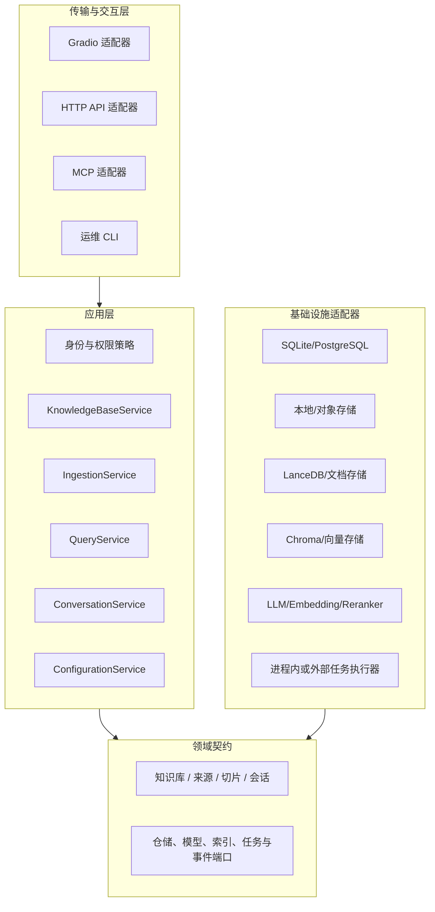
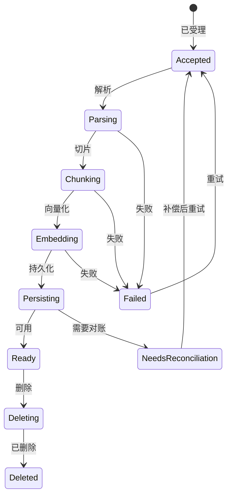

# 目标架构（TO-BE）

## 架构决策

第一阶段应演进为边界清晰的模块化单体，而不是直接进行微服务重写。现有组件库继续复用，在 UI/传输层与 RAG、持久化实现之间增加稳定的应用服务边界。



## 建议的模块边界

```text
src/knowledge_assistant/
├── domain/                 实体、值对象、权限策略、领域错误
├── application/            用例与端口
│   ├── knowledge_bases.py
│   ├── ingestion.py
│   ├── query.py
│   ├── conversations.py
│   └── identity.py
├── infrastructure/         SQL、存储、模型、任务和遥测适配器
├── transports/
│   ├── gradio/
│   ├── http/
│   └── mcp/
└── bootstrap/              类型化配置与依赖装配
```

该结构可以渐进引入，无需一次性移动所有上游源码。初期应用服务可以直接包装现有 `ktem` Pipeline。

## 核心应用契约

建议用例：

- `CreateKnowledgeBase`、`ListKnowledgeBases`、`DeleteKnowledgeBase`；
- `SubmitIngestion`、`GetIngestionStatus`、`RetryIngestion`、`DeleteSource`；
- `SearchKnowledgeBase`、`StreamAnswer`；
- `CreateConversation`、`AppendMessage`、`GetConversation`、`DeleteConversation`；
- `GetEffectiveConfiguration`、`ValidateProvider`、`UpdateUserSettings`。

建议端口：

- `UnitOfWork`；
- `SourceRepository`、`ConversationRepository`、`KnowledgeBaseRepository`；
- `BlobStore`、`DocumentStore`、`VectorIndex`；
- `ChatModel`、`EmbeddingModel`、`Reranker`；
- `IngestionJobRepository`、`JobRunner`、`EventPublisher`；
- `AuthorizationPolicy`、`AuditSink`、`Telemetry`。

契约应使用应用层/领域层 DTO，不应暴露 Gradio Update、LangChain 对象、LlamaIndex Node 或 Provider SDK 响应。

## 入库一致性模型

入库应成为显式状态机：



每个任务记录来源校验和、索引 Schema 版本、解析/切片/Embedding 配置、阶段进度、重试次数和错误类型。使用确定性 ID 保证重试幂等，并提供对账命令比较关系数据库、文件、文档存储和向量存储。

## 部署演进

### 阶段一：模块化单体

保持单一部署单元，引入稳定的应用服务、类型化配置、迁移、结构化观测和可测试适配器。这是近期目标。

### 阶段二：后台入库 Worker

优先拆分耗时且需要持久化的入库任务。Web 进程提交任务，Worker 负责解析、向量化和持久化。使用事务发件箱或等价机制避免任务丢失。

### 阶段三：按需拆分查询/API 服务

只有在独立扩缩容、安全隔离或多客户端需求得到量化证明后，才拆分查询服务。Gradio、REST 和 MCP 必须复用同一组应用契约。

## 第一轮重构的非目标

- 重写全部 Kotaemon 基础组件；
- 支持所有继承自上游的 Provider、Loader 和 Store；
- 在任务持久化语义建立前引入分布式消息系统；
- 一次性重命名或搬迁整个仓库；
- 在权限策略与契约测试完善前开放外部 API。
