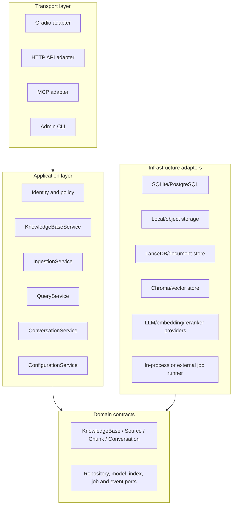
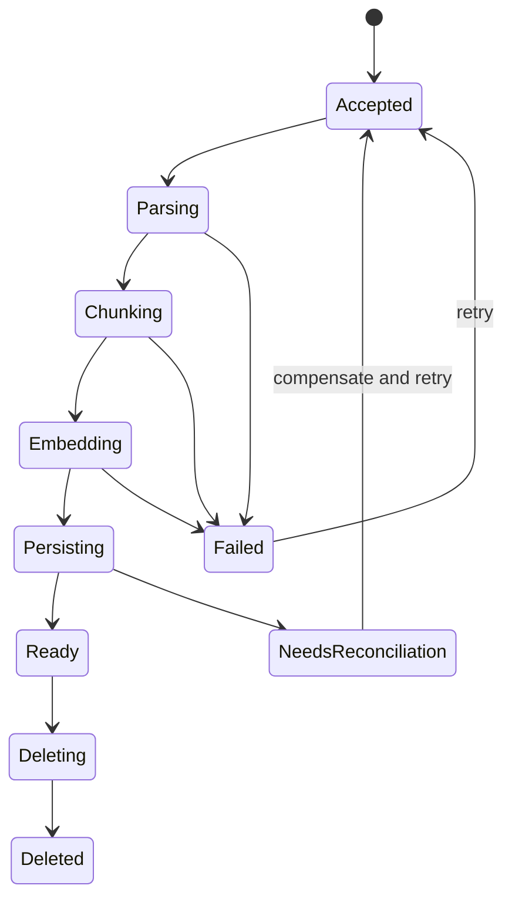

# Target architecture (TO-BE)

## Decision

Evolve first into a well-bounded modular monolith. Do not begin with a full microservice rewrite. The current component library can remain, while application services create stable use-case boundaries between transports/UI and RAG/persistence implementations.



## Proposed module boundaries

```text
src/knowledge_assistant/
├── domain/                 entities, value objects, policies, errors
├── application/            use cases and ports
│   ├── knowledge_bases.py
│   ├── ingestion.py
│   ├── query.py
│   ├── conversations.py
│   └── identity.py
├── infrastructure/         SQL, stores, providers, job runner, telemetry
├── transports/
│   ├── gradio/
│   ├── http/
│   └── mcp/
└── bootstrap/              typed settings and dependency container
```

This structure can be introduced incrementally without immediately moving all inherited source files. Initially, application services may wrap existing `ktem` pipelines.

## Core application contracts

Suggested use cases:

- `CreateKnowledgeBase`, `ListKnowledgeBases`, `DeleteKnowledgeBase`
- `SubmitIngestion`, `GetIngestionStatus`, `RetryIngestion`, `DeleteSource`
- `SearchKnowledgeBase`, `StreamAnswer`
- `CreateConversation`, `AppendMessage`, `GetConversation`, `DeleteConversation`
- `GetEffectiveConfiguration`, `ValidateProvider`, `UpdateUserSettings`

Suggested ports:

- `UnitOfWork` for relational state;
- `SourceRepository`, `ConversationRepository`, `KnowledgeBaseRepository`;
- `BlobStore`, `DocumentStore`, `VectorIndex`;
- `ChatModel`, `EmbeddingModel`, `Reranker`;
- `IngestionJobRepository`, `JobRunner`, `EventPublisher`;
- `AuthorizationPolicy`, `AuditSink`, `Telemetry`.

Contracts should use application/domain DTOs, not Gradio updates, LangChain objects, LlamaIndex nodes, or provider SDK responses.

## Ingestion consistency model

Treat ingestion as a state machine:



Every job records source checksum, index schema version, parser/splitter/embedding configuration, stage progress, retry count, and error category. Writes use deterministic IDs so retry is idempotent. A reconciliation command compares the relational manifest with blob, document, and vector stores.

## Deployment evolution

### Stage 1: modular monolith

One deployable process, stable application services, typed configuration, migrations, structured telemetry, and testable adapters. This is the recommended near-term target.

### Stage 2: background ingestion worker

Split only the durable, resource-heavy ingestion execution. The web process submits jobs; workers parse/embed/persist. Use a transactional outbox or equivalent to avoid losing accepted jobs.

### Stage 3: independent query/API service when justified

Only separate query serving if there is measured need for independent scaling, security isolation, or multiple clients. Gradio, REST, and MCP should all call the same application contracts.

## Non-goals for the first refactor

- Rewriting all Kotaemon primitives.
- Supporting every inherited provider/loader/store.
- Introducing distributed messaging before durable job semantics exist.
- Renaming/moving the entire repository in one change.
- Exposing an external API before authorization policies and contract tests exist.
