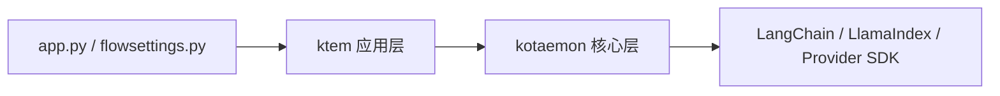

# 代码库地图

## 仓库结构

```text
knowledge-assistant/
├── app.py                    进程入口
├── flowsettings.py           产品配置与依赖注册
├── pyproject.toml            根包与 uv workspace
├── uv.lock                   可复现依赖锁
├── libs/
│   ├── kotaemon/             RAG/组件基础库
│   └── ktem/                 应用、UI、持久化与编排
├── scripts/                  启动、更新和迁移脚本
├── docs/                     MkDocs 开发文档
├── .github/workflows/        CI 工作流
└── ktem_app_data/            本地运行数据，不是源码
```

## `kotaemon`：可复用 RAG 基础能力

| 模块 | 关键路径 | 职责 |
| --- | --- | --- |
| 组件模型 | `base/component.py`、`schema.py` | 可调用组件、Node、Document、消息和检索文档 |
| Loader | `loaders/` | PDF、文本、HTML、Office、OCR 与组合解析 |
| 索引能力 | `indices/` | 入库、切片、向量检索、重排、证据与引用问答 |
| 模型 | `llms/`、`embeddings/`、`rerankings/` | 抽象基类与 Provider 适配器 |
| 存储 | `storages/` | Document Store 与 Vector Store 抽象及实现 |
| Agent/工具 | `agents/` | 保留的 Agent 代码，不属于当前产品基线 |

`BaseComponent` 与 `Document` 是最重要的跨包契约。许多适配器内部包装 LlamaIndex 或 LangChain 对象，这些属于实现依赖，不应成为应用层契约。

## `ktem`：应用与业务编排

| 模块 | 关键路径 | 职责 |
| --- | --- | --- |
| 应用生命周期 | `app.py`、`main.py` | 构建 Gradio、注册事件/扩展/推理、初始化索引 |
| 聊天 | `pages/chat/` | 会话 UI、回调编排、Pipeline 构建和流式渲染 |
| 知识库 | `index/manager.py`、`index/base.py` | 索引类型注册及创建/启动/删除生命周期 |
| 文件知识库 | `index/file/` | 动态 SQL、上传 UI、入库与检索 Pipeline |
| 推理 | `reasoning/` | 从检索到回答、证据和引用的 RAG 编排 |
| Provider 注册 | `llms/`、`embeddings/`、`rerankings/` | 保存并实例化模型规格 |
| 持久化 | `db/` | Engine 与共享 SQLModel 表 |
| 设置 | `settings.py`、`pages/settings.py` | 设置 Schema、用户设置持久化与 UI |
| 扩展机制 | `extension_protocol.py` | Pluggy Entry Point Hook |

## 根目录装配

`flowsettings.py` 是当前 Composition Root，但存在明显副作用。导入时会读取环境变量、创建数据和缓存目录、设置 Hugging Face 环境变量、定义存储位置、构造 Provider 字典，并注册推理实现和默认文件索引。

`app.py` 读取配置、设置 `GRADIO_TEMP_DIR`、构造 `ktem.main.App`、创建 UI、启用 Gradio 队列并启动浏览器。

## 依赖方向与边界泄漏



高层方向基本合理，但存在以下泄漏：

- 核心包依赖 Gradio 与 FastAPI；
- `ktem` 直接知道具体 Store 和模型类字符串；
- UI 页面直接查询 SQL 并创建 Pipeline；
- 动态导入使部分错误延迟到启动或用户操作时出现；
- 全局 Settings 实际充当 Service Locator。

## 应保留并治理的扩展点

| 扩展点 | 当前机制 | 建议 |
| --- | --- | --- |
| 推理 Pipeline | `KH_REASONINGS` 点分类名 | 保留注册表，启动时校验类型与元数据 |
| 索引类型 | `KH_INDEX_TYPES` 点分类名 | 保留注册表，生命周期收口到应用服务 |
| 入库/检索 | 索引配置与全局配置的优先级规则 | 保留端口，统一为类型化配置 |
| 模型 Provider | 含 `__type__` 的规格字典 | 保留适配器注册，增加脱敏与能力校验 |
| 第三方扩展 | Pluggy setuptools Entry Point | 增加兼容版本与故障隔离 |
| 存储 | `BaseDocumentStore`/`BaseVectorStore` | 增加健康检查、Schema 版本和清理语义 |

Agent、Web Search、MCP 消费、多种 OCR/Loader、替代向量库和分解推理仍存在于仓库，但不属于当前正式支持范围。后续应为每项能力标记“正式支持、实验性、兼容保留、删除”。
