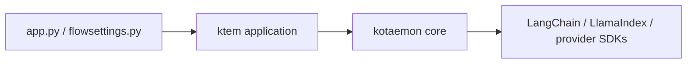

# Codebase map

## Repository layout

```text
knowledge-assistant/
├── app.py                    process entry point
├── flowsettings.py           product settings and dependency registrations
├── pyproject.toml            root package and uv workspace
├── uv.lock                   reproducible dependency graph
├── libs/
│   ├── kotaemon/             reusable RAG/component library
│   └── ktem/                 application, UI, persistence, and orchestration
├── scripts/                  OS launch/update and migration helpers
├── docs/                     MkDocs developer documentation
├── .github/workflows/        CI definitions
└── ktem_app_data/            local runtime state; not source code
```

## Package responsibilities

### `kotaemon`: reusable RAG primitives

| Area | Important paths | Responsibility |
| --- | --- | --- |
| Component model | `kotaemon/base/component.py`, `schema.py` | Callable components, nodes, documents, chat messages, retrieved documents |
| Loaders | `kotaemon/loaders/` | PDF, text, HTML, Office, OCR and composite parsing implementations |
| Index primitives | `kotaemon/indices/` | Ingestion, splitting, vector indexing/retrieval, reranking, evidence formatting and citation QA |
| Models | `kotaemon/llms/`, `embeddings/`, `rerankings/` | Provider-independent bases plus provider adapters |
| Storage | `kotaemon/storages/` | Document-store and vector-store abstractions and adapters |
| Agents/tools | `kotaemon/agents/` | Retained agent code; not registered by the current application baseline |

`BaseComponent` and `Document` are the most important cross-package contracts. Components are composed through fields/nodes and are invoked as pipeline stages. Many adapters wrap LlamaIndex or LangChain types; those libraries are implementation dependencies, not application-level contracts.

### `ktem`: application and orchestration

| Area | Important paths | Responsibility |
| --- | --- | --- |
| App lifecycle | `ktem/app.py`, `ktem/main.py` | Build Gradio blocks/pages, register events/extensions/reasonings, initialize indices |
| Chat | `ktem/pages/chat/` | Conversation UI, callback orchestration, pipeline creation, streaming render |
| Knowledge bases | `ktem/index/manager.py`, `index/base.py` | Index type registry, creation/start/delete lifecycle |
| File knowledge base | `ktem/index/file/` | Dynamic SQL resources, upload UI, indexing and retrieval pipelines |
| Reasoning | `ktem/reasoning/` | RAG orchestration from retrieval through answer/citations |
| Provider registries | `ktem/llms`, `embeddings`, `rerankings` | Persist and instantiate configured model specifications |
| Persistence | `ktem/db/` | Engine and shared SQLModel tables |
| Settings | `ktem/settings.py`, pages/settings.py | Settings schema, user persistence and UI |
| Extension mechanism | `ktem/extension_protocol.py` | Pluggy entry-point hooks |

### Root composition

`flowsettings.py` is currently the composition root, but also has side effects. Importing settings:

1. Reads environment variables.
2. Creates the application-data and cache directories.
3. Sets Hugging Face cache environment variables.
4. Defines SQLite, file, document-store, and vector-store locations.
5. Builds provider specification dictionaries.
6. Registers the reasoning implementation and default file index.

`app.py` imports resolved settings, sets `GRADIO_TEMP_DIR`, constructs `ktem.main.App`, builds the UI, enables the Gradio queue, and launches a local browser.

## Dependency direction

The intended high-level dependency direction is reasonable:



However, several boundaries leak:

- Core modules include Gradio and FastAPI in their dependency set.
- `ktem` knows concrete storage and model type strings.
- UI pages query SQL tables and construct pipelines directly.
- Dynamic imports defer many errors until startup or user interaction.
- Settings objects behave as a service locator used throughout the process.

## Extension points that should be retained

| Extension point | Current mechanism | Recommendation |
| --- | --- | --- |
| Reasoning pipeline | Dotted class names in `KH_REASONINGS` | Keep registry; validate at startup with typed metadata |
| Index type | Dotted class names in `KH_INDEX_TYPES` | Keep registry; move lifecycle behind an application service |
| File indexing/retrieval | Per-index config or global dotted settings | Keep ports; replace precedence rules with one resolved config model |
| Model providers | `__type__` specification dictionaries | Keep adapter registry; redact secrets and validate capabilities |
| Third-party extensions | Pluggy setuptools entry points | Keep, but add compatibility version and failure isolation |
| Stores | `BaseDocumentStore`/`BaseVectorStore` | Keep interfaces; add health, schema version, and transactional cleanup semantics |

## Areas not in the active product baseline

The repository still contains agents, web search, MCP consumption, multiple OCR/document loaders, alternative vector stores, decomposition reasoning, and other provider adapters. Their presence does not mean they are supported. A future cleanup should classify each module as **supported**, **experimental**, **upstream compatibility**, or **remove**, then align dependencies and tests with that decision.
