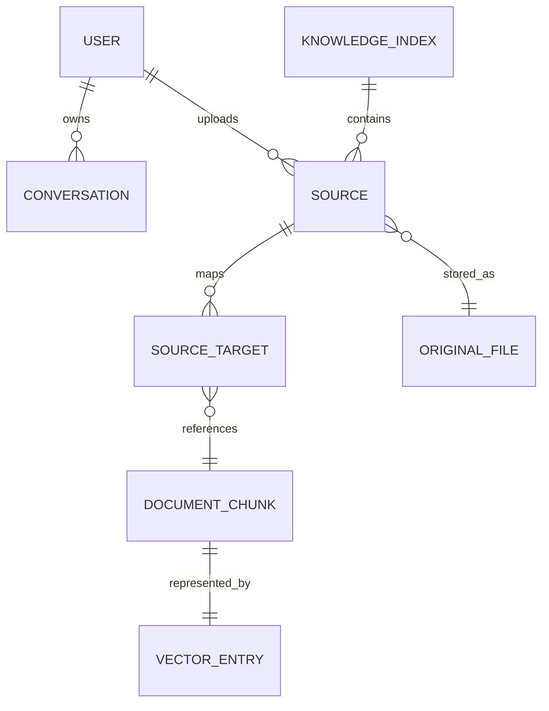

# Data and configuration

## Local data topology

The default data root is `ktem_app_data`. Runtime state is organized below `user_data`:

```text
ktem_app_data/
├── user_data/
│   ├── sql.db                 users, settings, conversations, index metadata
│   ├── files/index_<id>/      original uploaded files
│   ├── docstore/              LanceDB document collections
│   └── vectorstore/           Chroma collections
├── gradio_tmp/
├── markdown_cache_dir/
├── chunks_cache_dir/
├── zip_cache_dir/
├── zip_cache_dir_in/
└── huggingface/               model/cache data
```

The location can be changed with `KH_APP_DATA_DIR`. The process must have create/read/write/delete permission for the whole data root.

## Relational model

Shared SQLModel tables include:

| Model | Key fields | Purpose |
| --- | --- | --- |
| `User` | id, username, username_lower, password, admin | Local identities and administrator flag |
| `Conversation` | id, name, user, is_public, data_source, timestamps | Chat history and selected data encoded in JSON |
| `Settings` | id, user, setting | Per-user flattened settings JSON |
| `IssueReport` | issues, chat, settings, user | User-submitted diagnostics |
| `ktem__index` | id, name, index_type, config | Knowledge-base definitions |

Each `FileIndex` dynamically creates three more tables based on its numeric ID:

- `index__<id>__source`: source file metadata and owner.
- `index__<id>__index`: source-to-target relationships (`document`/`vector` entries).
- `index__<id>__group`: named groups of source IDs per user.

Dynamic table creation makes each index locally isolated, but complicates migrations, introspection, backups, and cross-index queries. The target model should use stable tables with an `index_id` column unless benchmarked scale demands physical separation.

## Cross-store identity

The effective data graph is:



Only part of this graph is enforced by SQLite constraints. IDs connecting SQLite, LanceDB, Chroma, and the filesystem are application-managed. Backups and deletes must therefore be treated as a coordinated multi-store operation.

## Configuration layers

Configuration currently comes from several sources:

1. Defaults imported from `theflow.settings.default`.
2. Root `flowsettings.py` constants.
3. `.env`/process environment through `python-decouple`.
4. Per-index JSON configuration stored in SQLite.
5. Per-user flattened settings stored in SQLite/Gradio state.
6. Dynamic extension declarations and dotted Python class paths.

The effective precedence is implemented across modules rather than represented by one typed object. This makes configuration drift and invalid combinations hard to diagnose.

## Important environment variables

| Group | Variables | Notes |
| --- | --- | --- |
| Runtime | `KH_APP_VERSION`, `KH_GRADIO_SHARE`, `KH_APP_DATA_DIR` | Share mode can expose the UI externally and needs an explicit security warning |
| OpenAI-compatible | `OPENAI_API_KEY`, `OPENAI_API_BASE`, `OPENAI_CHAT_MODEL`, `OPENAI_EMBEDDINGS_MODEL` | Becomes default if configured first/explicitly |
| Azure OpenAI | endpoint, key, API version, chat/embedding deployments | Chat and embedding registrations are independent |
| Local/Ollama | `LOCAL_MODEL`, `LOCAL_MODEL_EMBEDDINGS` | Uses `KH_OLLAMA_URL` internally; add it to `.env.example` if it is intended public config |
| Other providers | Anthropic, Google, Groq, Cohere, Mistral, Voyage keys | Retained compatibility surface; not all are baseline commitments |
| PDF UI | `PDFJS_VERSION_DIST` | Asset preparation/runtime concern |

Never commit `.env` or log provider specifications containing keys. Configuration diagnostics should report provider name, model, endpoint host, and capability without secret values.

## Provider resolution

Provider dictionaries contain a `spec` with a dynamic `__type__` and a `default` flag. `set_first_default()` selects the first option if none is marked default. This behavior is order-dependent and should be replaced with explicit validation:

- exactly one default chat model when chat is enabled;
- exactly one compatible default embedding model for indexing;
- optional reranker with declared language/context capabilities;
- vector index records embedding provider/model/dimension;
- startup fails early with actionable errors for unresolved classes or missing credentials.

## Schema and backup recommendations

- Enable Alembic and stop using import-time `create_all` as the production migration strategy.
- Add schema version tables for SQLite and each index collection.
- Store an index manifest: embedding model/dimension, splitter, loader, and creation version.
- Define a consistent snapshot process covering SQLite, original files, LanceDB, and Chroma.
- Provide `check`, `repair`, `export`, and `restore` commands before production use.
- Test restore into an empty data directory in CI or a scheduled workflow.
