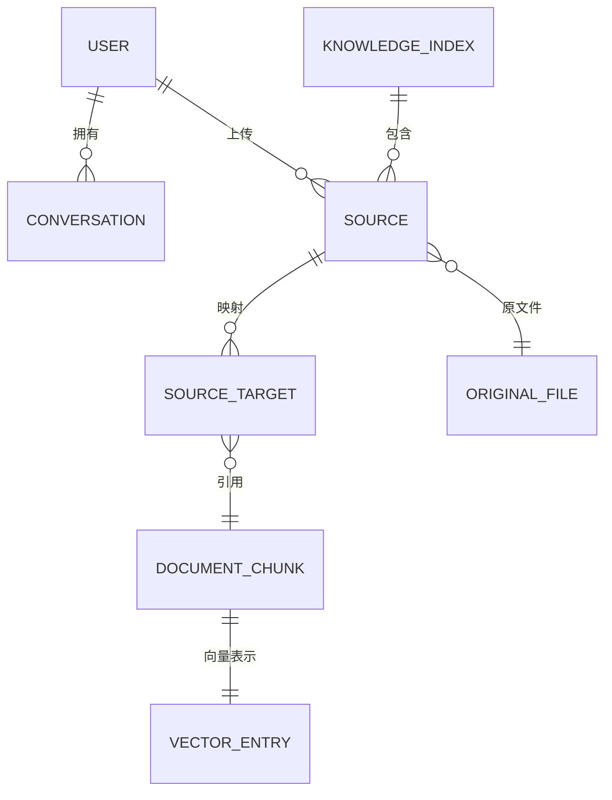

# 数据与配置

## 本地数据结构

默认数据根目录为 `ktem_app_data`：

```text
ktem_app_data/
├── user_data/
│   ├── sql.db                 用户、设置、会话、索引元数据
│   ├── files/index_<id>/      原始上传文件
│   ├── docstore/              LanceDB 文档集合
│   └── vectorstore/           Chroma 向量集合
├── gradio_tmp/
├── markdown_cache_dir/
├── chunks_cache_dir/
├── zip_cache_dir/
├── zip_cache_dir_in/
└── huggingface/               模型与缓存
```

可以通过 `KH_APP_DATA_DIR` 修改位置。运行进程必须拥有整个数据根目录的创建、读写和删除权限。

## 关系模型

| 模型 | 关键字段 | 用途 |
| --- | --- | --- |
| `User` | id、username、password、admin | 本地身份和管理员标记 |
| `Conversation` | id、name、user、is_public、data_source、时间戳 | 会话历史和 JSON 数据源 |
| `Settings` | id、user、setting | 用户扁平化设置 |
| `IssueReport` | issues、chat、settings、user | 用户问题与诊断信息 |
| `ktem__index` | id、name、index_type、config | 知识库定义 |

每个 `FileIndex` 根据数字 ID 动态创建三张表：

- `index__<id>__source`：来源文件元数据与所有者；
- `index__<id>__index`：来源与文档/向量目标的关系；
- `index__<id>__group`：用户命名的文件分组。

动态建表提供了物理隔离，但增加了迁移、备份、巡检和跨索引查询难度。除非规模测试证明必须隔离，目标模型应采用稳定表并增加 `index_id`。

## 跨存储身份关系



SQLite 只约束其中一部分关系。SQLite、LanceDB、Chroma 和文件系统之间的 ID 由应用代码维护，因此备份和删除必须作为跨存储协调操作处理。

## 配置来源与优先级

当前配置来自：

1. `theflow.settings.default` 默认值；
2. 根目录 `flowsettings.py`；
3. `.env`/进程环境变量；
4. SQLite 中每个索引的 JSON 配置；
5. SQLite/Gradio State 中的用户设置；
6. 扩展声明和点分 Python 类路径。

有效优先级散落在多个模块中，没有一个统一的类型化对象，容易产生配置漂移与无效组合。

## 关键环境变量

| 分组 | 变量 | 说明 |
| --- | --- | --- |
| 运行时 | `KH_APP_VERSION`、`KH_GRADIO_SHARE`、`KH_APP_DATA_DIR` | Share 模式可能对外暴露 UI |
| OpenAI 兼容 | Key、Base URL、Chat Model、Embedding Model | 配置后可能成为默认 Provider |
| Azure OpenAI | Endpoint、Key、API Version、Deployment | Chat 与 Embedding 独立注册 |
| Ollama | `LOCAL_MODEL`、`LOCAL_MODEL_EMBEDDINGS` | 内部还使用 `KH_OLLAMA_URL` |
| 其他 Provider | Anthropic、Google、Groq、Cohere、Mistral、Voyage | 兼容能力不等于正式产品承诺 |
| PDF UI | `PDFJS_VERSION_DIST` | PDF 静态资源配置 |

不得提交 `.env`，不得在日志中输出包含 Key 的 Provider 规格。诊断信息只应输出 Provider 名称、模型、Endpoint Host 和能力。

## Provider 解析与校验

Provider 字典通过 `__type__` 动态实例化，并使用 `default` 标记。`set_first_default()` 在没有默认项时选择第一项，该行为依赖字典顺序。建议改为启动时显式校验：

- 启用聊天时必须有且只有一个默认 Chat Model；
- 入库必须有一个兼容的默认 Embedding Model；
- Reranker 可选，但要声明语言与上下文能力；
- 索引 Manifest 必须记录 Embedding Provider、模型和维度；
- 类无法解析或凭证缺失时，启动阶段立即给出可操作错误。

## Schema 与备份建议

- 启用 Alembic，生产环境不再依赖导入时 `create_all`；
- 为 SQLite 和索引集合建立 Schema Version；
- 保存包含模型、维度、切片器、Loader 和创建版本的索引 Manifest；
- 建立覆盖 SQLite、原文件、LanceDB、Chroma 的一致快照流程；
- 提供 `check`、`repair`、`export`、`restore` 命令；
- 在 CI 或定时任务中验证恢复到空数据目录。
