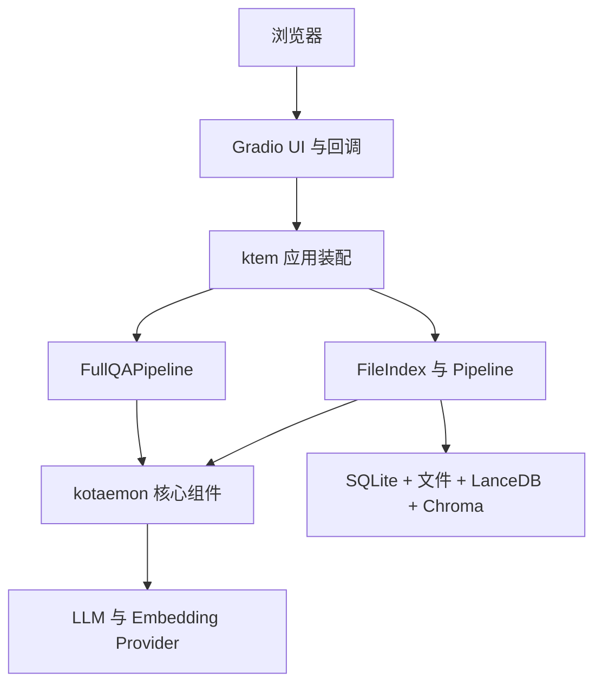

# 开发者指南

## 文档目的与考察范围

本文档基于当前仓库代码，而不是产品设想。考察范围包括根应用、两个工作区包、配置、持久化、测试、脚本与 CI；`ktem_app_data`、缓存、虚拟环境和第三方静态资源不作为业务源码分析。

仓库约有 224 个 Python 文件、24,000 行 Python 代码。大部分能力继承自 Kotaemon，实际代码面远大于当前产品注册范围。因此本文区分：

- **当前基线**：通过 `flowsettings.py` 和 UI 实际可达的功能；
- **保留能力**：代码仍存在，但不属于当前产品承诺；
- **目标架构**：推荐演进方向，尚未实现。

## 核心结论

Knowledge Assistant 当前是一个模块化单体：单个 Python 进程承担 Gradio UI、登录、设置、知识库管理、入库、检索、LLM 调用、引用生成和本地持久化。

内部组件抽象具有复用价值，但应用边界较弱：UI 回调直接创建并执行 Pipeline；配置文件同时进行 Provider 注册与目录初始化；一次入库跨越四类存储且没有统一事务。下一步不应直接拆微服务，而应先在单体内部引入应用服务与稳定端口，用测试保护后再开放 HTTP/MCP 或拆分进程。

## 阅读顺序

1. [当前架构](../architecture/current-architecture.md)
2. [代码库地图](codebase-map.md)
3. [运行时流程](runtime-flows.md)
4. [数据与配置](data-and-configuration.md)
5. [质量与风险评估](quality-and-risks.md)
6. [目标架构](../architecture/target-architecture.md)
7. [实施路线图](roadmap.md)

## 当前产品契约

| 关注点 | 当前约定 |
| --- | --- |
| 运行时 | Python 3.10.14+，单 Gradio 进程 |
| 包管理 | `uv`，工作区成员为 `libs/kotaemon` 与 `libs/ktem` |
| 用户访问 | 本地用户名/密码，默认启用用户管理 |
| 知识来源 | 一个私有 `FileIndex`，支持 PDF/TXT/Markdown |
| 检索 | 向量、文本或混合检索 |
| 推理 | `ktem.reasoning.simple.FullQAPipeline` |
| 元数据 | SQLite + SQLModel/SQLAlchemy |
| 原始文件 | 本地文件系统 |
| 切片 | LanceDB 文档存储 |
| 向量 | Chroma 向量存储 |
| 模型 | 由环境变量注册 Provider |
| 公共 API | 无，浏览器回调直接调用 Python 对象 |

## 后续工程原则

- 移动代码前先用特征测试保护现有 RAG 链路；
- 区分正式支持与仅为上游兼容而保留的模块；
- 在增加传输协议前明确领域与应用 API；
- 将入库视为可恢复、可观测的任务；
- 分别版本化配置、数据库 Schema 和索引 Schema；
- 将 Provider SDK 隔离在模型、Embedding、Reranker 适配器后；
- 在扩缩容或隔离需求被证明前，坚持模块化单体。
