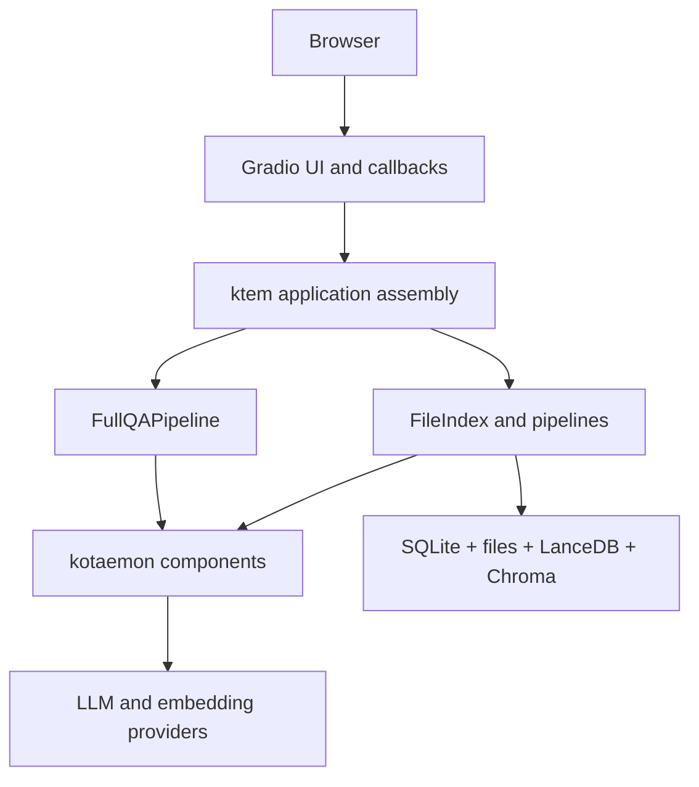

# Developer guide

## Purpose and review scope

This guide is an engineering assessment of the repository at the current revision. It is written from the code rather than from an intended product design. The review covers the root application, both workspace packages, configuration, persistence, tests, scripts, and CI. Generated data under `ktem_app_data`, caches, the virtual environment, and vendored browser assets are not treated as source modules.

The repository contains about 224 Python files and 24,000 lines of Python. Most code is inherited from Kotaemon and still exposes a broader capability surface than the product currently registers. Therefore, this documentation distinguishes among:

- **Registered baseline**: reachable through the current `flowsettings.py` and UI.
- **Retained capability**: code remains available but is not part of the current product contract.
- **Target architecture**: recommended direction, not yet implemented.

## Executive summary

Knowledge Assistant is currently a modular monolith: one Python process owns the Gradio UI, authentication, settings, knowledge-base management, indexing, retrieval, LLM calls, citations, and local persistence.

The internal component abstractions are useful, but application boundaries are weak. UI callbacks create and invoke pipelines directly; configuration also performs provider registration and filesystem initialization; persistence is split across four stores without a transaction boundary. The best next step is not an immediate microservice split. First introduce application services and stable ports inside the monolith, protect them with tests, and only then expose HTTP/MCP or move workloads out of process.

## Reading order

1. [Current architecture](../architecture/current-architecture.md): deployed shape and supported baseline.
2. [Codebase map](codebase-map.md): ownership and important source files.
3. [Runtime flows](runtime-flows.md): startup, ingestion, retrieval, and chat sequences.
4. [Data and configuration](data-and-configuration.md): stores, tables, settings, and provider wiring.
5. [Quality and risks](quality-and-risks.md): evidence-based gaps and priorities.
6. [Target architecture](../architecture/target-architecture.md): recommended boundaries.
7. [Roadmap](roadmap.md): ordered implementation plan and acceptance criteria.

## Current product contract

| Concern | Current contract |
| --- | --- |
| Runtime | Python 3.10.14+, one Gradio process |
| Package management | `uv`, workspace members `libs/kotaemon` and `libs/ktem` |
| User access | Local username/password; management enabled by default |
| Knowledge source | One private `FileIndex`, PDF/TXT/Markdown |
| Retrieval | Vector, text, or hybrid depending on user settings |
| Reasoning | `ktem.reasoning.simple.FullQAPipeline` |
| Metadata | SQLite through SQLModel/SQLAlchemy |
| Original files | Local filesystem |
| Chunks | LanceDB document store |
| Embeddings | Chroma vector store |
| Model providers | Registered from environment variables |
| Public API | None; browser callbacks call Python objects directly |

## Engineering principles for subsequent work

- Preserve the existing RAG path behind characterization tests before moving packages.
- Separate product-supported behavior from inherited but unregistered modules.
- Make domain/application APIs explicit before adding transport APIs.
- Treat indexing as a recoverable job with observable stages and cleanup semantics.
- Version configuration, database schema, and index schema independently.
- Keep provider-specific SDK objects behind model, embedding, and reranking interfaces.
- Prefer a modular monolith until scale or isolation requirements justify deployment separation.
