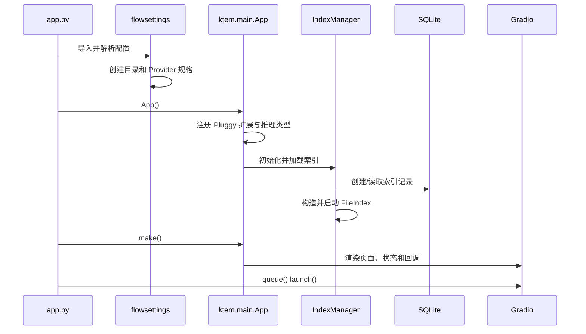
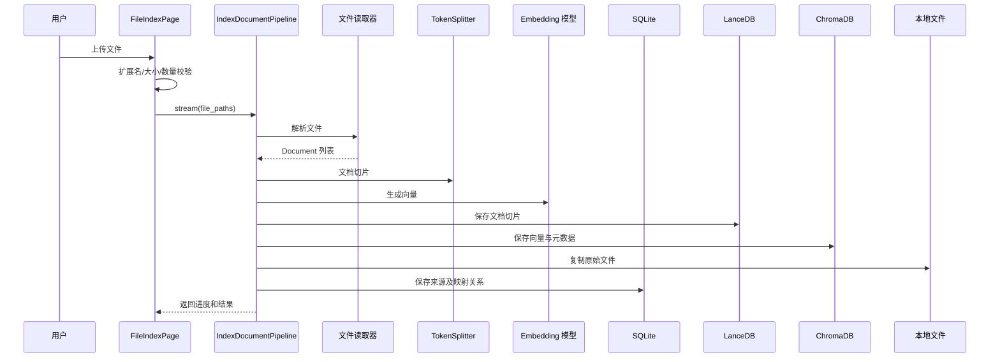
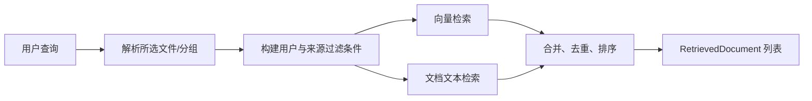
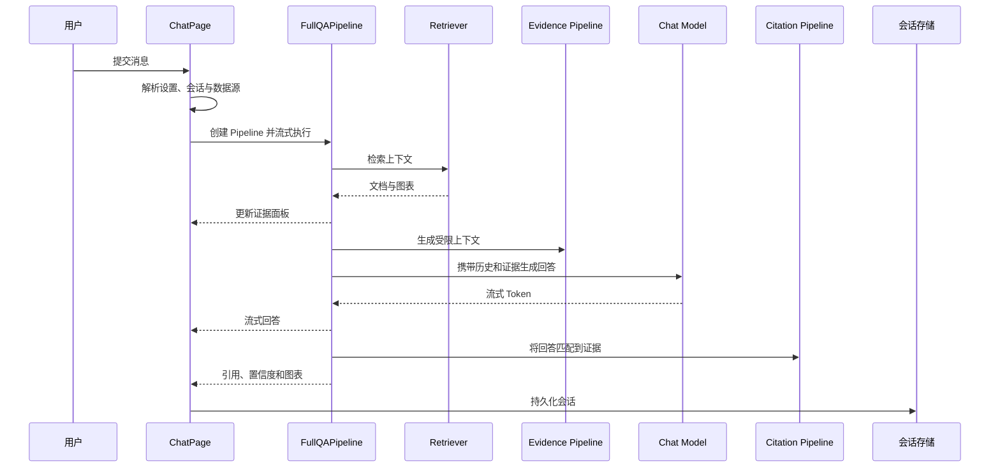

# 运行时流程

## 启动与 UI 构建

配置导入和应用初始化并非无副作用；知识库需要在 UI 构建前完成初始化，因为其设置和页面会影响组件树；公共事件只是进程内回调，不是外部事件总线；Gradio Session State 保存扁平化设置和当前用户 ID。

## 文件入库

这些写入不在同一事务内，中断可能产生部分状态。目前没有持久化任务记录、幂等键或自动对账 Worker。

应正式定义以下不变量：

- Source 记录必须对应存在的原始文件；
- 每条 Source-to-Chunk 关系必须指向 Document Store 中的切片；
- 每个向量必须存在对应切片，且向量维度兼容；
- 重复入库必须有明确的替换或版本语义；
- 任一阶段失败都必须可重试或可补偿；
- 必须记录构建索引时的模型与切片配置。

## 检索

`FileIndex.get_retriever_pipelines()` 解析 Retriever 类型，并注入索引资源、用户设置和所选 Source ID。默认 `DocumentRetrievalPipeline` 支持组合向量/文本检索与相关性评分。

私有知识库按用户过滤 Source。该权限规则目前分散在索引和检索代码中；开放 API 前必须将其收口为显式策略并增加反向权限测试。

## 聊天与回答生成

相关性评分可能在回答生成期间通过线程执行，最终展示证据前会等待线程完成。代码虽有异步方法占位，但当前有效路径是同步 Generator 流式执行。

## 错误处理与可观测性

当前主要依赖异常、控制台输出和 `Document(channel="debug"|"info")`。上传、检索、模型请求与会话之间缺少统一关联 ID。最低可观测性要求包括：

- Request、Conversation、User、Index、Source、Job ID；
- 带秘密与内容脱敏的结构化日志；
- 阶段耗时、文档数与切片数；
- Provider 延迟、错误与 Token 指标；
- SQLite、文档库、向量库、Provider 健康检查；
- 用户安全错误与开发诊断错误分离。
