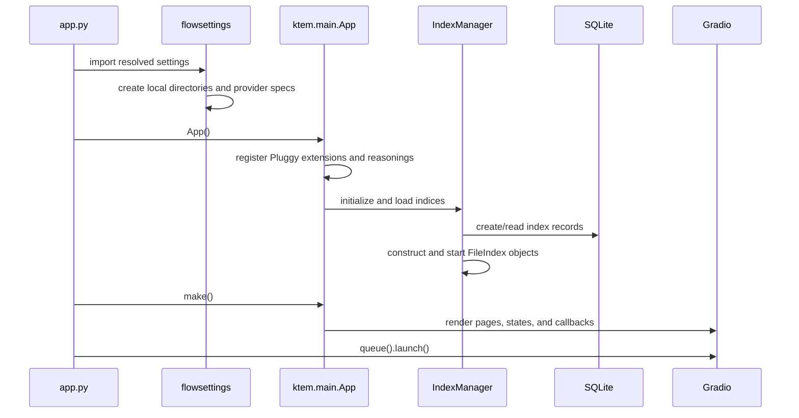
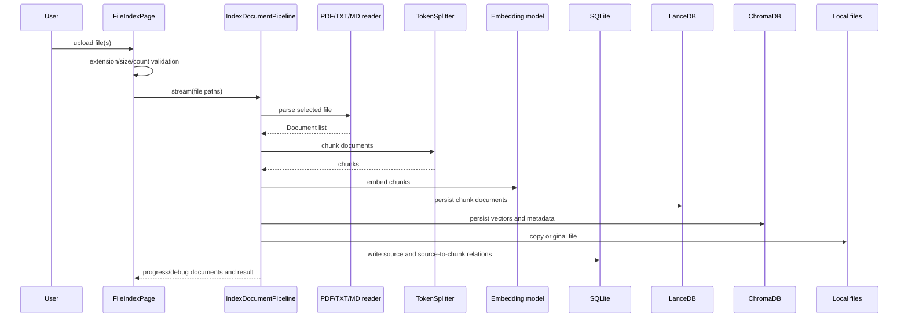
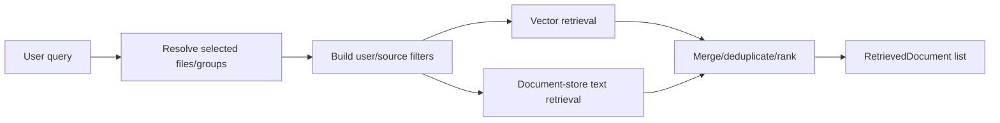
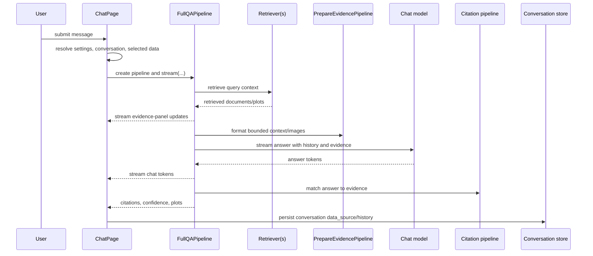

# Runtime flows

## Startup and UI construction

Important behavior:

- Import and initialization are not side-effect free.
- Indices are available before UI construction because their settings and pages affect the rendered component tree.
- Public events are an in-process callback mechanism, not an external event bus.
- Gradio session state carries flattened settings and the current user identifier.

## File ingestion

The ingestion path starts in a large Gradio page callback and ends in multiple stores.

The exact write order lives in `ktem/index/file/pipelines.py`. Because these writes are not one transaction, interruption can leave partial state. Delete/rebuild functions are therefore operationally important, but today there is no durable job record, idempotency key, or reconciliation worker.

### Ingestion invariants to formalize

- A source record must refer to an existing original file.
- Every source-to-chunk relation must refer to a document-store entry.
- Every vector entry must have a retrievable document chunk with compatible embedding dimensions.
- Reindexing the same file must have explicit replace/version semantics.
- Failure at any stage must be retryable or compensatable.
- The model and splitter configuration used to build an index must be recorded.

## Retrieval

`FileIndex.get_retriever_pipelines()` resolves the configured retriever class and supplies index resources, user settings, and selected source IDs. The default `DocumentRetrievalPipeline` can combine vector and text retrieval and optionally generate relevance scores.

Private indices scope sources by user. This authorization rule is embedded in index and retrieval logic; it should become an explicit policy test before any API is exposed.

## Chat and answer generation

Relevance scoring may run in a thread while the answer is generated; the reasoning pipeline joins that thread before presenting final evidence. There is an asynchronous method placeholder, but the active path is synchronous generator streaming.

## Error and observability behavior

Current behavior relies mainly on exceptions, console output, and streamed `Document(channel="debug"|"info")` messages. There is no consistent correlation ID across upload, retrieval, model request, and conversation. A minimum observability layer should add:

- request, conversation, user, index, source, and ingestion-job identifiers;
- structured logs with secret/content redaction;
- stage timings and document/chunk counts;
- provider latency/error/token metrics;
- health checks for SQLite, document store, vector store, and configured providers;
- a user-safe error taxonomy distinct from developer diagnostics.
